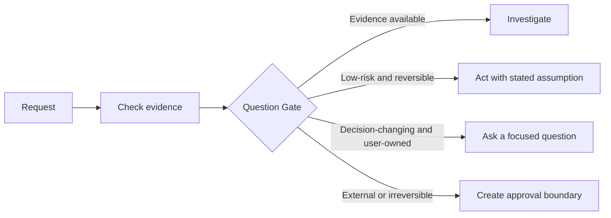

<div align="center">

# DecisionGate

### Gets the small things done. Thinks before the big things. Never decides for you.

**No interrogation for simple work. No risky guessing for important work. No accidental sends, posts, prices, payments, or deploys.**

[](https://github.com/mxfff114-star/decision-gate) [](LICENSE) [](https://agentskills.io/specification)

</div>

## The AI You Meant To Hire

You should be able to talk to an AI like a capable teammate:

- Give it a simple task, and it gets on with it.
- Give it a messy goal, and it does the homework before coming back to you.
- Give it something consequential, and it makes the choice clear before anything leaves the building.

That is DecisionGate: a small skill that stops an AI from being either an anxious questionnaire or an overconfident intern.

## What Changes For You

| You say | Without DecisionGate | With DecisionGate |
| --- | --- | --- |
| "Fix the title in this document." | It asks five setup questions. | It fixes the title. |
| "Find investors and reach out." | It either asks you for everything or emails the wrong people. | It researches a shortlist, writes drafts, and asks only what changes the outcome before sending. |
| "Post this update." | It may publish with the wrong wording, audience, or timing. | It gives you a ready-to-approve post and waits at the exact publish boundary. |
| "Use the same approach as last time." | It mistakes familiarity for permission. | It reuses your style, but checks again when money, reputation, or authority is on the line. |

**The result:** less back-and-forth, less rework, and far fewer moments where you wonder what your AI just did in your name.

## The Simple Promise

1. **If it is small and reversible, do it now.**
2. **If it can be researched, research it first.**
3. **If your answer changes the outcome, ask one good question.**
4. **If it can cost money, affect people, or go public, prepare everything and let you make the final call.**

## How It Stays Useful

Under the hood, DecisionGate uses a lightweight decision policy. It helps an agent decide when to investigate, when to ask, when to make a reversible assumption, and when to stop for approval.



## Three Modes, Not One More Interview

| Mode | When it activates | What the user sees |
| --- | --- | --- |
| **Light** | A clear, reversible task | The work gets done. Material assumptions are stated. |
| **Standard** | A consequential tradeoff or plan | A compact decision card: objective, options, recommendation, tradeoffs, risk, rollback, and next approval. |
| **Strict** | Send, publish, deploy, delete, spend, change permissions, or mutate production data | The same decision card plus an exact approval boundary. The agent prepares; the host must enforce the stop. |

This is why DecisionGate is not a generic clarification checklist. It gives an agent a visible mode of judgment.

## What It Feels Like

| Situation | A weak agent | With DecisionGate |
| --- | --- | --- |
| Rename one heading | Starts a discovery interview. | Makes the exact edit. |
| Find investors and send a deck | Sends outreach because the user sounds urgent. | Researches fit, asks only for the missing investment criteria and sending authority, then stages drafts. |
| Quote a prospect | Treats a preference for concise messages as pricing authority. | Separates tone preference from pricing guardrails and approval to send. |
| Deploy or modify production data | Assumes "go ahead" is blanket permission. | Binds approval to the exact action, target, parameters, and expiry. |

## What Ships Today

- A portable [Agent Skills](https://agentskills.io/specification) workflow for Codex, Claude Code, Cursor, Copilot, and other compatible hosts.
- A four-part [Question Gate](references/question-gate.md) that prevents ritual questioning.
- A [decision-profile template](references/decision-profile.md) for confirmed preferences, scope, and rechecks.
- Three explicit [risk tiers](references/risk-tiers.md) and a reusable [Decision Card](assets/decision-card.md).
- Versioned [DecisionRecord](contracts/decision-record.schema.json) and [ApprovalRequest](contracts/approval-request.schema.json) contracts for host integrations.
- Transparent [blind-test record](VALIDATION.md) and a public [evaluation protocol](EVALS.md).

## What It Does Not Pretend To Do

This release is a policy layer. A markdown skill can tell an agent to pause; it cannot itself enforce a pause inside every host. Tool-level enforcement needs an adapter that validates an ApprovalRequest immediately before the write action. That is the next build target, not a claim made today.

## Install

```bash
npx skills add mxfff114-star/decision-gate -a codex
```

The skill activates when a consequential request has a decision-critical ambiguity. It stays out of the way for clear, low-risk, reversible work.

## Who It Is For

- **Agent builders** who need a reusable policy before wiring up email, databases, deployment, payment, or CRM tools.
- **Developers and operators** who want agents to move quickly without treating every request as authorization.
- **Founders and teams** who need an assistant that becomes easier to work with over time without silently turning familiarity into permission.

## Roadmap

| Now | Next | Later |
| --- | --- | --- |
| Decision policy, risk tiers, decision cards, contracts, examples, and eval protocol | OpenAI Agents SDK, LangGraph, and MCP approval adapters | Team policy packs, preference governance, audit exports, and hosted control surfaces |

Before a 1.0 recommendation, the project must meet its [release gates](EVALS.md): cross-host installation, 80 labeled cases, auditable preferences, and complete approval coverage for simulated write actions.

## Contribute

The most valuable contributions are de-identified traces that show where the skill asked too much, assumed too much, or handled a boundary correctly. See [CONTRIBUTING.md](CONTRIBUTING.md). Do not include credentials, customer data, or private messages in issues or pull requests.

## Repository Map

| Path | Purpose |
| --- | --- |
| [SKILL.md](SKILL.md) | Runtime decision policy |
| [SPEC.md](SPEC.md) | Product intent, scope, and maintenance contract |
| [references](references) | Question, preference, and approval rules |
| [contracts](contracts) | Portable decision and approval schemas |
| [EVALS.md](EVALS.md) | Evaluation protocol and release gates |

## License

[Apache-2.0](LICENSE)

