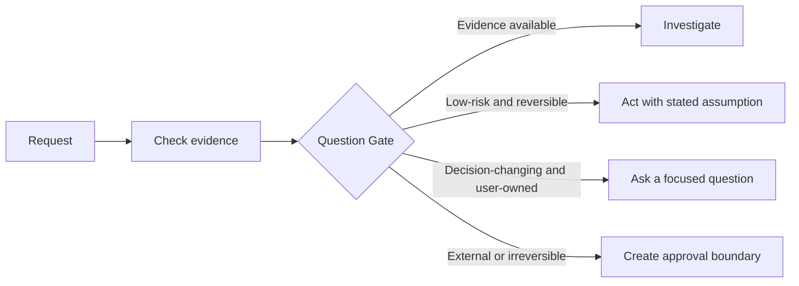

<div align="center">

# AskUp

### The decision system that teaches your agent to manage up.

**Most agents start doing before they understand. AskUp teaches an agent to ask up first, learn how you think, and gradually earn the freedom to handle small things without asking again.**

[](https://github.com/mxfff114-star/ask-up) [](LICENSE) [](https://agentskills.io/specification)

</div>

## Stop Getting Work You Did Not Ask For

Tell an agent, "help me with my pitch," and it often starts writing a generic deck before it knows your company, your investor, your goal, or what "good" means to you. It may sound busy while quietly taking you in the wrong direction.

AskUp turns that first rush into a useful conversation:

1. **It asks until the important parts are clear.** Goals, audience, boundaries, constraints, and what a good result looks like. It researches what it can before asking you.
2. **It says back what it understands.** You see a shared working brief before important work begins, so a misunderstanding is cheap to fix.
3. **It remembers what you confirmed.** Each useful answer teaches the agent how you prefer to work. Over time, the same agent asks less, makes fewer wrong drafts, and can safely do more on its own.

The point is not to make AI slower. It is to spend a little attention at the start so you stop paying for rework, correction, and "that is not what I meant" later.

## Start Deep. Then Move Fast.

AskUp starts in **Context Mode** by default. On a new or meaningful task, it asks focused questions in small rounds until both sides share the same brief. Once a preference, boundary, or working style is confirmed, it becomes usable context for compatible future tasks.

At any time, the agent offers a clear choice:

| Choose | What happens |
| --- | --- |
| **Build context (recommended)** | The agent asks the decision-changing questions, confirms its understanding, then works from that brief. This is the default at the start of a relationship or for a new kind of task. |
| **Fast lane** | The agent skips discovery for this request and makes the best reversible progress it can. It still stops for sends, publishing, spending, deleting, permissions, production changes, or other consequential actions. |

This is not a forever-onboarding ritual. As the shared context becomes reliable, clear and reversible tasks move straight to execution. The user can also choose Fast lane whenever the task is simple and they do not want a check-in.

## What Changes For You

| You say | Without AskUp | With AskUp |
| --- | --- | --- |
| "Help me raise a seed round." | It writes a generic fundraising plan before it understands your business or target. | It asks what is missing, researches the rest, confirms the plan it heard, then builds the right investor list, deck, and outreach drafts. |
| "Fix the title in this document." | It carries the same uncertainty into a tiny task. | Once it knows the context, it fixes the title without reopening discovery. |
| "Post this update." | It may publish with the wrong wording, audience, or timing. | It gives you a ready-to-approve post and waits at the exact publish boundary. |
| "Use the same approach as last time." | It forgets what it learned or mistakes familiarity for permission. | It reuses confirmed style and preferences, but checks again when money, reputation, or authority is on the line. |

**The result:** less back-and-forth, less rework, and far fewer moments where you wonder what your AI just did in your name.

## The Simple Promise

1. **Before important work: understand, do not guess.**
2. **If it can be researched, research it before asking.**
3. **Ask in focused rounds until a shared brief closes the meaningful ambiguity.**
4. **After context is confirmed: do clear, reversible work directly.**
5. **When the user chooses Fast lane: make reversible progress without the check-in.**
6. **If it can cost money, affect people, or go public, prepare everything and let the user make the final call.**

## How It Stays Useful

Under the hood, AskUp uses a lightweight decision policy. It helps an agent decide when to investigate, when to ask, when to make a reversible assumption, and when to stop for approval.



## Three Action Modes, With A User Choice

| Mode | When it activates | What the user sees |
| --- | --- | --- |
| **Light** | A clear, reversible task after context is known, or a user-selected Fast lane request | The work gets done. Material assumptions are stated. |
| **Standard** | A new, meaningful task with an unresolved tradeoff | Build context in focused rounds, confirm a compact shared brief, then work. |
| **Strict** | Send, publish, deploy, delete, spend, change permissions, or mutate production data | The same decision card plus an exact approval boundary. The agent prepares; the host must enforce the stop. |

This is why AskUp is not a generic clarification checklist. It makes the early conversations valuable, then gets out of the way when understanding has been earned.

## What It Feels Like

| Situation | A weak agent | With AskUp |
| --- | --- | --- |
| First discussion of a fundraising goal | Writes a generic deck from a five-word prompt. | Asks focused questions, researches what it can, then reflects back the investor, stage, story, constraints, and next deliverables it understood. |
| Rename one heading after the brief is confirmed | Reopens an irrelevant discovery interview. | Makes the exact edit. |
| Find investors and send a deck | Sends outreach because the user sounds urgent. | Uses the confirmed context, researches fit, asks only for a new decision, then stages drafts. |
| Quote a prospect | Treats a preference for concise messages as pricing authority. | Separates tone preference from pricing guardrails and approval to send. |
| Deploy or modify production data | Assumes "go ahead" is blanket permission. | Binds approval to the exact action, target, parameters, and expiry. |

## What Ships Today

- A portable [Agent Skills](https://agentskills.io/specification) workflow for Codex, Claude Code, Cursor, Copilot, and other compatible hosts.
- A four-part [Question Gate](references/question-gate.md) that prevents ritual questioning.
- A [decision-profile template](references/decision-profile.md) for confirmed preferences, scope, and rechecks.
- Three explicit [risk tiers](references/risk-tiers.md) and a reusable [Decision Card](assets/decision-card.md).
- Versioned [DecisionRecord](contracts/decision-record.schema.json) and [ApprovalRequest](contracts/approval-request.schema.json) contracts for host integrations.
- Transparent [blind-test record](VALIDATION.md) and a public [evaluation protocol](EVALS.md).

## What It Does Not Pretend To Do

This release is a policy layer. A markdown skill can tell an agent to pause; it cannot itself enforce a pause inside every host. Tool-level enforcement needs an adapter that validates an ApprovalRequest immediately before the write action. That is the next build target, not a claim made today.

## Install

```bash
npx skills add mxfff114-star/ask-up -a codex
```

The skill starts in Context Mode for a meaningful task when it lacks a reliable shared brief. The user may choose Fast lane to skip low-risk confirmation. It stays out of the way for clear, low-risk, reversible work once enough context is known.

## Who It Is For

- **Agent builders** who need a reusable policy before wiring up email, databases, deployment, payment, or CRM tools.
- **Developers and operators** who want agents to move quickly without treating every request as authorization.
- **Founders and teams** who need an assistant that becomes easier to work with over time without silently turning familiarity into permission.

## Roadmap

| Now | Next | Later |
| --- | --- | --- |
| Decision policy, risk tiers, decision cards, contracts, examples, and eval protocol | OpenAI Agents SDK, LangGraph, and MCP approval adapters | Team policy packs, preference governance, audit exports, and hosted control surfaces |

Before a 1.0 recommendation, the project must meet its [release gates](EVALS.md): cross-host installation, 80 labeled cases, auditable preferences, and complete approval coverage for simulated write actions.

## Contribute

The most valuable contributions are de-identified traces that show where the skill asked too much, assumed too much, or handled a boundary correctly. See [CONTRIBUTING.md](CONTRIBUTING.md). Do not include credentials, customer data, or private messages in issues or pull requests.

## Repository Map

| Path | Purpose |
| --- | --- |
| [SKILL.md](SKILL.md) | Runtime decision policy |
| [SPEC.md](SPEC.md) | Product intent, scope, and maintenance contract |
| [references](references) | Question, preference, and approval rules |
| [contracts](contracts) | Portable decision and approval schemas |
| [EVALS.md](EVALS.md) | Evaluation protocol and release gates |

## License

[Apache-2.0](LICENSE)

